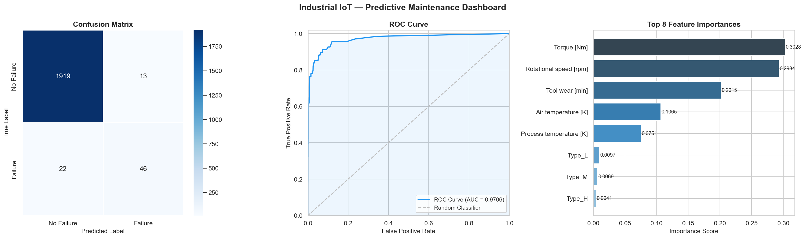

# ⚙️ Industrial IoT Predictive Maintenance System

A machine learning system that predicts machine failure from industrial IoT sensor data, with a real-time Streamlit web interface.

---

## 📌 Project Overview

This project simulates a real-world Industrial IoT scenario where sensor data from machines is collected and used to predict the probability of machine failure before it occurs — enabling proactive maintenance and reducing downtime.

---

## 🗂️ Project Structure

```
IOT/
├── data/
│   └── data.csv                          # Industrial IoT sensor dataset
├── model/
│   ├── predictive_maintenance_model.pkl  # Trained RandomForest model
│   └── dashboard.png                     # Evaluation plots
├── main.py                               # ML pipeline (train & evaluate)
├── app.py                                # Streamlit frontend (real-time inference)
├── .gitignore
└── README.md
```

---

## 📊 Dataset

Based on the **AI4I 2020 Predictive Maintenance Dataset**.

| Feature | Description |
|---|---|
| `Air temperature [K]` | Ambient air temperature |
| `Process temperature [K]` | Machine process temperature |
| `Rotational speed [rpm]` | Spindle rotational speed |
| `Torque [Nm]` | Torque applied to the tool |
| `Tool wear [min]` | Cumulative tool wear time |
| `Type` | Machine quality type: L / M / H |
| `Machine failure` | Target — 0: No Failure, 1: Failure |

- **10,000 rows**, no missing values
- **Class imbalance**: 96.6% No Failure / 3.4% Failure

---

## 🤖 ML Pipeline — `main.py`

| Step | Function | Description |
|---|---|---|
| 1 | `load_data()` | Load CSV, inspect shape, missing values, class distribution |
| 2 | `preprocess_data()` | Drop ID columns, one-hot encode `Type`, sanitize column names |
| 3 | `split_data()` | Stratified 80/20 train-test split |
| 4 | `train_model()` | Train `RandomForestClassifier` with `class_weight='balanced_subsample'` |
| 5 | `evaluate_model()` | Compute Accuracy, Precision, Recall, F1, ROC-AUC, Confusion Matrix |
| 6 | `plot_results()` | Dashboard: Confusion Matrix heatmap · ROC Curve · Feature Importance |
| 7 | `save_model()` | Save trained model as `.pkl` using `joblib` |
| — | `predict_machine_failure()` | Real-time inference — returns failure probability for a sensor reading |

### Model Performance

| Metric | Score |
|---|---|
| Accuracy | 98.20% |
| Precision | 77.59% |
| **Recall** | **66.18%** |
| F1 Score | 71.43% |
| **ROC-AUC** | **96.38%** |

### Top Feature Importances

| Feature | Importance |
|---|---|
| Rotational speed [rpm] | 31.0% |
| Torque [Nm] | 29.2% |
| Tool wear [min] | 20.0% |
| Air temperature [K] | 10.3% |
| Process temperature [K] | 7.4% |

---

## 🖥️ Streamlit App — `app.py`

A clean web interface for real-time failure prediction.

### Features
- Input sliders/fields for all 6 sensor readings
- Machine Type dropdown (L / M / H)
- Displays **failure probability** (4 decimal places)
- 🚨 Warning banner if probability > 0.30
- ✅ Success banner if probability ≤ 0.30
- Collapsible input summary table
- Sidebar with model info

---

## ✅ Prerequisites

Make sure you have the following installed before running the project:

### 🐍 Python
- Python **3.9 or higher** is required
- Download from: https://www.python.org/downloads/
- Verify installation:
  ```bash
  python --version
  ```

### 📦 pip
- Comes bundled with Python 3.9+
- Verify installation:
  ```bash
  pip --version
  ```

### 🍺 Homebrew (macOS only — required for XGBoost)
- Required to install the OpenMP runtime on macOS
- Install Homebrew:
  ```bash
  /bin/bash -c "$(curl -fsSL https://raw.githubusercontent.com/Homebrew/install/HEAD/install.sh)"
  ```
- Then install OpenMP:
  ```bash
  brew install libomp
  ```

### 📚 Python Libraries

| Library | Version | Purpose |
|---|---|---|
| `pandas` | ≥ 1.5 | Data loading & preprocessing |
| `numpy` | ≥ 1.23 | Numerical operations |
| `scikit-learn` | ≥ 1.2 | ML model, metrics, splitting |
| `matplotlib` | ≥ 3.6 | Plotting |
| `seaborn` | ≥ 0.12 | Statistical visualizations |
| `joblib` | ≥ 1.2 | Model serialization |
| `streamlit` | ≥ 1.28 | Web frontend |

> Install all at once:
> ```bash
> pip install pandas numpy scikit-learn matplotlib seaborn joblib streamlit
> ```

### 🖥️ System Requirements
- OS: macOS, Linux, or Windows 10/11
- RAM: 4 GB minimum (8 GB recommended)
- Disk: ~200 MB free space

---

## 🚀 Getting Started

### 1. Clone the repository
```bash
git clone https://github.com/tha-run/Predictive-Maintenance-System.git
cd Predictive-Maintenance-System
```

### 2. Create a virtual environment
```bash
python -m venv .venv
source .venv/bin/activate        # macOS / Linux
.venv\Scripts\activate           # Windows
```

### 3. Install dependencies
```bash
pip install pandas numpy scikit-learn matplotlib seaborn joblib streamlit
```

### 4. Train the model
```bash
python main.py
```

### 5. Launch the Streamlit app
```bash
streamlit run app.py
```

Then open **http://localhost:8501** in your browser.

---

## 🛠️ Tech Stack

| Library | Purpose |
|---|---|
| `pandas` | Data loading & preprocessing |
| `numpy` | Numerical operations |
| `scikit-learn` | ML model, metrics, train-test split |
| `matplotlib` / `seaborn` | Evaluation plots |
| `joblib` | Model serialization |
| `streamlit` | Web frontend |

---

## 📈 Evaluation Dashboard



---
